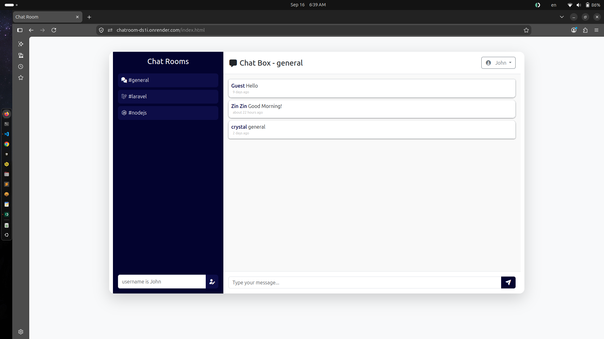

# TypeScript Chatroom

A real-time chat application built with TypeScript, Firebase, and Webpack. Users can sign in with email/password or Google, switch between chat rooms, update their display name, and view profile information while messages are synced in real time from Firestore.

Live demo: https://chatroom-ds1i.onrender.com/index.html



## Features

- Real-time messaging using Firebase Firestore
- Email/password authentication and Google sign-in
- Chat room switching: general, laravel, nodejs
- Dynamic username display and local profile updates
- User profile page with account metadata
- Password reset flow
- Responsive UI with Bootstrap and Font Awesome
- Built as a static frontend with TypeScript and bundled assets

## Tech Stack

- TypeScript
- Firebase Authentication
- Firebase Firestore
- Webpack 5
- Webpack Dev Server
- Bootstrap 5
- Font Awesome
- date-fns

## Architecture

This project follows a lightweight frontend architecture:

- Static HTML pages live in `public/` and are served as a simple web app.
- TypeScript logic is organized under `src/`.
- Firebase configuration is centralized in `src/firebaseConfig.ts`.
- Authentication logic is encapsulated in `src/Authorize.ts`.
- Chat data access and room logic live in `src/ChatRoom.ts`.
- UI rendering logic is handled by `src/MessageUI.ts`.
- Webpack bundles the TypeScript modules and injects/serves the app assets.

The app uses Firebase as the backend for both authentication and chat persistence. When a user sends a message, it is written to a Firestore collection named `chats`. Message listeners subscribe to the active room and update the UI whenever new messages appear.

## Project Structure

```text
l40chatroom/
├─ public/
│  ├─ css/
│  │  └─ style.css
│  ├─ dist/
│  │  ├─ app.js
│  │  ├─ checkauth.js
│  │  ├─ profile.js
│  │  ├─ resetpassword.js
│  │  ├─ signin.js
│  │  └─ signup.js
│  ├─ index.html
│  ├─ profile.html
│  ├─ reset.html
│  ├─ signin.html
│  └─ signup.html
├─ src/
│  ├─ auth/
│  │  ├─ checkauth.ts
│  │  ├─ profile.ts
│  │  ├─ resetpassword.ts
│  │  ├─ signin.ts
│  │  └─ signup.ts
│  ├─ app.ts
│  ├─ Authorize.ts
│  ├─ ChatRoom.ts
│  ├─ firebaseConfig.ts
│  └─ MessageUI.ts
├─ node_modules/
├─ package-lock.json
├─ package.json
├─ tsconfig.json
├─ webpack.config.js
├─ screenshoot.png
├─ README.md
└─ note.md
```

## Requirements

Before running the project locally, make sure you have:

- Node.js 18 or newer
- npm
- A Firebase project with:
  - Authentication enabled
  - Firestore enabled
  - a web app configured

Update the Firebase configuration in `src/firebaseConfig.ts` with your project's values.

## Local Setup

1. Install dependencies:

```bash
npm install
```

2. Start the development server:

```bash
npm run serve
```

3. Open the app in the browser:

```text
http://localhost:8080
```

## Production Build

```bash
npm run build
```

This generates the bundled assets used by the frontend.

## Deployment

This project is configured for static hosting on Render.

- Build/Publish directory: `public/`
- App served from the deployed static site URL above
- Firebase domain must be added to the authorized domains in Firebase Authentication settings for sign-in to work in production

## Notes

This is a frontend-focused learning project that demonstrates TypeScript + Firebase integration for a chat application. It is intentionally lightweight and is designed to be easy to understand and extend.
